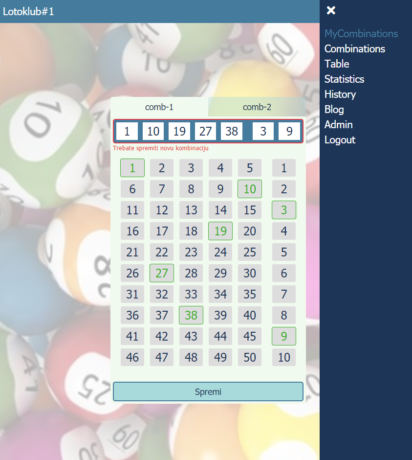

<<<<<<< HEAD
# lotoclub
App for organizing group of eurojackpot players
=======
# Lotoclub

Goal of this app is to help group of Eurojackpot players organize their play.
Users can register, add and update their combinations for next draw, checkout other users' combinations, see some statistics from previous draws (like frequency of a number or number's last draw). Admin of a group can define deadline for submiting combinations, number of played combinations for each draw. There will be automated number picking alghoritam to increase chances of scoring.

# Technologies

- JavaScript
- Express.js
- MongoDB

# Setup

`npm install`
`npm start`

# Project Status

This is work in progress. Planning on refactoring frontend to React soon.
>>>>>>> table
